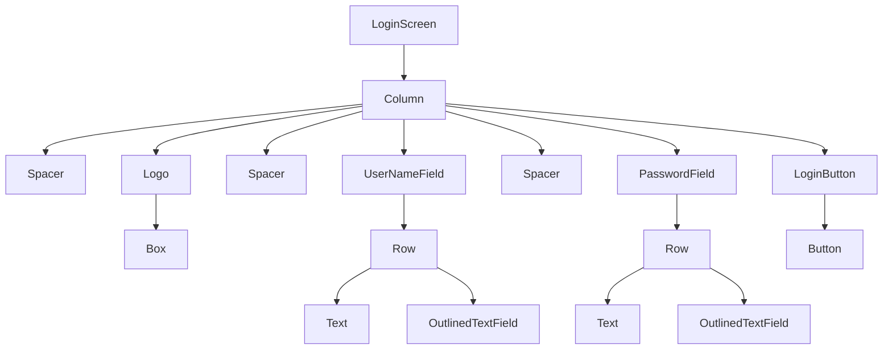

### 3 Stages of composition

- Composition
- Layout
- Drawing
  We are going to discuss on the **Layout** Stages

###

 <details>
  <summary>Login Screen</summary>
<!-- Spacer -->

```kotlin
@Composable
fun LoginScreen() {
  Column(
      modifier = Modifier
          .fillMaxSize()
          .padding(16.dp),
      horizontalAlignment = Alignment.CenterHorizontally,
      verticalArrangement = Arrangement.Center
  ) {
      Logo()
      Spacer(modifier = Modifier.height(16.dp))
      UserNameField()
      Spacer(modifier = Modifier.height(8.dp))
      PasswordField()
      Spacer(modifier = Modifier.height(16.dp))
      LoginButton()
  }
}

@Composable
private fun UserNameField() {
  Row(
      modifier = Modifier.fillMaxWidth().padding(8.dp),
      verticalAlignment = Alignment.CenterVertically
  ) {
      Text(
          text = "UserName",
          modifier = Modifier.weight(1f).padding(end = 8.dp)
      )
      OutlinedTextField(
          value = "",
          onValueChange = { },
          modifier = Modifier.weight(2f).fillMaxWidth(),
      )
  }

}

@Composable
private fun PasswordField() {
  Row(
      modifier = Modifier.fillMaxWidth().padding(8.dp),
      verticalAlignment = Alignment.CenterVertically
  ) {
      Text(
          text = "Password",
          modifier = Modifier.weight(1f).padding(end = 8.dp)
      )
      OutlinedTextField(
          value = "",
          onValueChange = { },
          modifier = Modifier.weight(2f).fillMaxWidth(),
      )
  }
}

@Composable
private fun LoginButton() {
  Button(
      onClick = {},
      modifier = Modifier
          .fillMaxWidth()
          .height(48.dp)
  ) {
      Text("Login")
  }
}

@Composable
private fun ColumnScope.Logo() {
  Box(
      modifier = Modifier
          .align(Alignment.CenterHorizontally)
          .size(120.dp)
          .clip(CircleShape)
          .background(Color.Magenta)
  )

}

```

</details>

 <details>
  <summary>UI Tree of Login Screen</summary>
<!-- Spacer -->



<!-- Spacer -->
  </details>

<!-- Layout Stage -->

In this stage we have the UI tree.
There are main phases in this stage

- Measure phase
- Place phase

In the measure phase the UI tree node is measured such as how the width and height of it.
Notice that over here(UI tree) a node can have multiple children,in that case the first children will be measure their size and then it report to the parent node and then parent node will measure it own size.
...The same for the remaining nodes..

Then it will place children.
so basically the steps are:
- Measure the children -> Decide in own size ->Place the children

Explain the UI tree of each node which measure it children and decide it child


Once all elements are measured in size,
the tree is walked again, and all placement instructions
are executed in the placement phase.

We are note going to describe the implementation details,if we want to implement detailed checkout the description box for resouces.

[Insha-allah Next from 4 min](https://youtu.be/zMKMwh9gZuI)
- Explain the Layout() composable signature
- Implement MeasurePolicy as separate class instead of 
- Implement the MeasureResult class
- Explain the Constraint

MeasurePolicy is the how the measure children and place children

<details>
<summary> Possible code </summary>

```Kotlin
class MainActivity : ComponentActivity() {
    override fun onCreate(savedInstanceState: Bundle?) {
        super.onCreate(savedInstanceState)
        setContent {
            TutorialsTheme {
                Layout(
                    content = {},
                    modifier = Modifier,
                    measurePolicy = MyLayoutMeasurePolicy()
                )
            }
        }
    }
}

class MyLayoutMeasurePolicy : MeasurePolicy {
    override fun MeasureScope.measure(
        measurables: List<Measurable>,
        constraints: Constraints
    ): MeasureResult {
        val placeAbles = measurables.map { it.measure(constraints) }
        val height = 10
        val width = 10
        this.layout(width = width, height = height, placementBlock = {
            //place the logic here
            placeAbles.forEach {
               // it.placeRelative()
            }
        })
        return MyMeasureResult(height=height,width=width)
    }

}

class MyMeasureResult(
    override val height: Int ,
    override val width: Int,
    override val alignmentLines: Map<AlignmentLine, Int> = emptyMap(),
) : MeasureResult {
    override fun placeChildren() {

    }

}

```

</details>